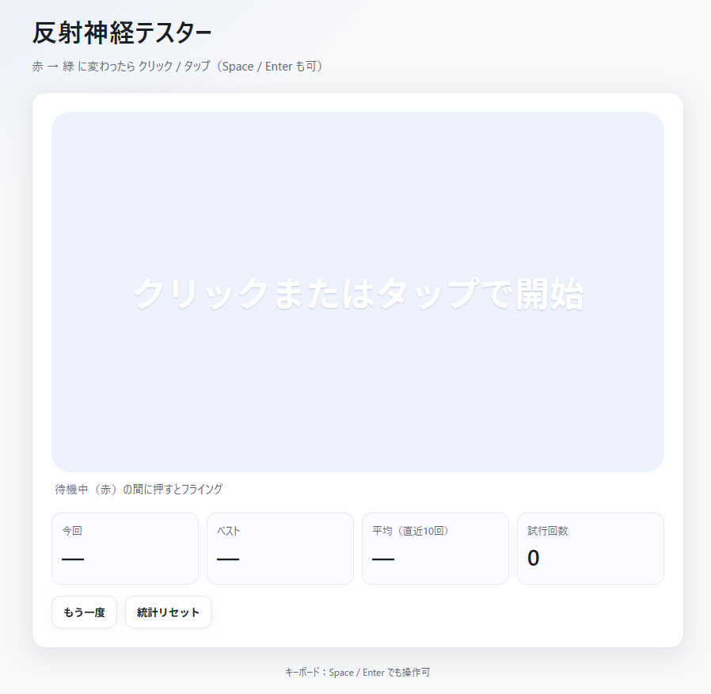

# Reflex Tester App

反射神経（反応時間）を測定するシンプルな Web アプリです。  
赤 → 緑 に変わったらできるだけ早くクリック／タップ。

## デモ
- GitHub Pages: https://seiya-matsuoka.github.io/reflex-tester-app/

## スクリーンショット

  
  
  
  

## 使い方
1. 画面中央のパッドをクリック（または Space / Enter）。
2. 待機中（赤）は押さないでください（押すとフライング）。
3. 緑になったらクリック（または Space / Enter）。反応時間を表示します。
4. 直近10回の平均・ベスト・試行回数はブラウザに保存されます（LocalStorage）。

## 仕様
- 状態遷移：`idle → waiting → ready → result`
- 計測：`performance.now()`
- 保存：`localStorage` キー `reflex_tester_stats`
  - `attempts`（試行回数）
  - `best`（ベストms）
  - `recent`（直近10件）

## 開発メモ
- セットアップ不要：`index.html` をブラウザで開くだけで動作します。
- 構成：index.html, style.css, script.js

## 技術スタック
- HTML / CSS / JavaScript (Vanilla)